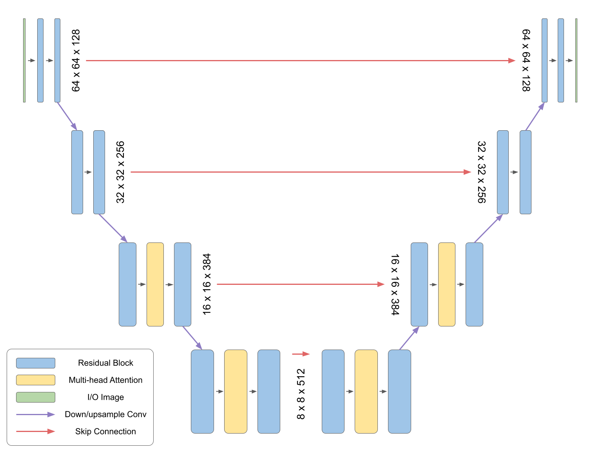
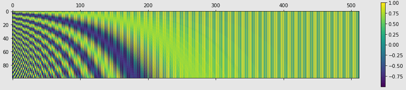
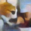

# DiffusionModel generating cats

This project is a diffusion model following a similar architecture to Imagen to create a neural network capable of generating images. It has used a public dataset of images of cats to train. It doesn't use a text input, so it generate a new image of a cat base only in the random noise use as input.

## Architecture

The model follow a similar architecture as Imagen, but with some notaceble changes. The main one is that the text promt has been remove. This makes the training faster and, more importantly, it allow us to train directly with a dataset of images without needing to add a text to describing each image.

The architecture is mainly an autoencoder. It uses a a mix of convolutional layers and attention layer. To not lose information of the image, some skip connection has been added to help the model to keep te original information when reducing the dimensionality of the image.

## Concept of the model

This is a diffusion neuralnetwork. The way it is train is by applying white noise to an image with a small increment each time. The neuralnetwork will have the task of recuperate the original image without noise. When using it we simply provide a white noise image and the model will 

